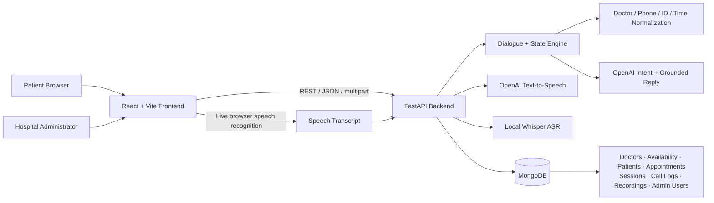

# AI Voice Agent for Hospital

<p align="center">
  
</p>

<p align="center">
  A bilingual Urdu/English hospital voice assistant and administration platform
  for doctor discovery, availability, appointment management, patient records,
  call transcripts, and voice-call monitoring.
</p>

<p align="center">
  
  
  
  
  
</p>

> [!IMPORTANT]
> This repository is an academic/final-year project. It is not an emergency
> service, medical-diagnosis system, or production clinical platform.

## Contents

- [Project overview](#project-overview)
- [Main features](#main-features)
- [System architecture](#system-architecture)
- [Technology stack](#technology-stack)
- [Project structure](#project-structure)
- [Prerequisites](#prerequisites)
- [Installation](#installation)
- [Environment configuration](#environment-configuration)
- [ASR model setup](#asr-model-setup)
- [Running the project](#running-the-project)
- [Application routes](#application-routes)
- [Voice appointment flow](#voice-appointment-flow)
- [API overview](#api-overview)
- [Database and identifiers](#database-and-identifiers)
- [Authentication rules](#authentication-rules)
- [Testing](#testing)
- [MongoDB backup and data safety](#mongodb-backup-and-data-safety)
- [Troubleshooting](#troubleshooting)
- [Production security notice](#production-security-notice)

## Project overview

AI Voice Agent for Hospital provides two entry points:

1. **Patient Voice Agent** — public access without login.
2. **Admin Dashboard** — administrator authentication is required.

The patient can speak naturally in Urdu or English. The system preserves the
conversation state across turns, identifies the requested operation, grounds
doctor selections against the MongoDB catalog, checks availability, collects
the required patient information, and asks for one final summary confirmation
before creating a booking.

The administration portal provides hospital staff with tools for doctors,
availability schedules, patients, appointments, call records, recordings,
system status, and administrator profiles.

## Main features

### Patient voice agent

- Public access; no patient login required.
- Agent greeting plays before microphone listening starts.
- Calm male Urdu text-to-speech voice.
- Single animated microphone button to start and stop the call.
- Live transcript and voice controls on the left.
- Full conversation history on the right.
- Browser-based real-time speech recognition for the live web experience.
- Local Whisper-compatible ASR endpoints for uploaded audio.
- Urdu, Roman Urdu, English, and numeric speech normalization.
- Spoken phone-number extraction with Urdu/English digits, compound numbers,
  and `double`/`triple` patterns.
- Spoken compact ID recognition for appointments, doctors, and patients.
- Symptom-to-department routing.
- Exact doctor-name grounding with match-quality ranking.
- Date and available-slot normalization.
- Final booking confirmation only after all required details are collected.
- Call recording, transcript storage, intent, confidence, and session history.

### Supported voice workflows

- List or discover doctors.
- Check doctor/department availability.
- Book a new appointment.
- Book for a registered patient.
- Cancel an appointment.
- Reschedule an appointment.
- End the conversation naturally.

### Admin dashboard

- Shifa-branded blue/red responsive interface.
- Dashboard statistics from MongoDB.
- Doctor CRUD operations.
- CSV doctor import.
- Doctor filtering by specialization, availability, and status.
- Doctor sorting by ID or name.
- Pagination with 25 doctors per page.
- Weekly doctor availability and time-slot management.
- Appointment creation, editing, cancellation, and permanent deletion.
- Patient records and patient appointment history.
- Call logs with transcripts, message counts, recordings, and durations.
- System monitoring for MongoDB, ASR, LLM, and TTS services.
- Global search for patients, doctors, and appointments.
- Administrator signup, login, and password recovery.
- Clickable administrator profile in the header.
- Administrator name/username editing.
- Password change using the current password.
- JPG, PNG, or WebP profile-picture upload (maximum 2 MB).

## System architecture



### Request flow

1. The frontend creates one session ID for the complete call.
2. Each final transcript is sent to `POST /voice/text-turn`.
3. The backend classifies the intent and extracts entities.
4. Deterministic normalizers resolve doctor names, IDs, phone numbers, dates,
   and time slots.
5. MongoDB data grounds doctor and appointment decisions.
6. The dialogue engine calculates missing fields and creates the next response.
7. OpenAI TTS produces the spoken response.
8. MongoDB saves the turn and session state.
9. A booking is committed only after the final confirmation.

## Technology stack

| Layer | Technology |
|---|---|
| Frontend | React 19, React Router, Vite, Lucide React |
| Backend | Python, FastAPI, Pydantic, Uvicorn |
| Database | MongoDB, PyMongo, GridFS |
| LLM | OpenAI API (`gpt-5-nano` by default) |
| TTS | OpenAI `gpt-4o-mini-tts` |
| ASR | Local Hugging Face Whisper model, Transformers, PyTorch |
| Testing | Python `unittest`, ESLint, Vite production build |
| Time zone | `Asia/Karachi` through `tzdata` |

## Project structure

```text
voice_agent_backend/
├── app.py                         # FastAPI application and HTTP endpoints
├── config.py                      # Environment-based configuration
├── schemas.py                     # Pydantic response/request models
├── requirements.txt               # Python dependencies
├── domain/
│   ├── auth_validation.py         # Admin credential rules
│   ├── doctor_matching.py         # Doctor-name normalization and scoring
│   ├── id_normalization.py        # APT/DC/PC spoken-ID normalization
│   ├── phone_normalization.py     # Urdu/English phone extraction
│   ├── symptom_routing.py         # Symptom-to-department mapping
│   └── time_normalization.py      # Spoken time and slot resolution
├── services/
│   ├── asr_service.py             # Local Whisper transcription
│   ├── dialogue_service.py        # Context, availability, and missing fields
│   ├── llm_service.py             # Intent detection and grounded replies
│   ├── tts_service.py             # OpenAI speech generation
│   └── turn_service.py            # End-to-end conversation orchestration
├── storage/
│   └── mongo_store.py             # MongoDB, GridFS, CRUD, and persistence
├── scripts/
│   ├── migrate_compact_ids.py     # Legacy ID migration utility
│   └── run_urdu_agent_qa.py       # Isolated Urdu workflow QA
├── tests/                          # Backend regression tests
└── Frontend/admin-dashboard/
    ├── public/                     # Shifa logo and public assets
    └── src/
        ├── api/                    # Backend client
        ├── components/             # Header, sidebar, cards, and badges
        ├── layout/                 # Protected admin layout
        ├── pages/                  # Patient and admin screens
        └── styles/                 # Application styling
```

## Prerequisites

- Python 3.11 or newer.
- Node.js 20 or newer with npm.
- MongoDB Community Server or a MongoDB Atlas database.
- An OpenAI API key.
- A compatible local Hugging Face Whisper model for backend audio endpoints.
- Chrome or Microsoft Edge for the live browser voice experience.
- FFmpeg available on the system when the local ASR pipeline needs to decode
  compressed audio formats.

## Installation

### 1. Clone the repository

```powershell
git clone https://github.com/xafar786/AI-Voice-Agent-for-Hospital.git
cd AI-Voice-Agent-for-Hospital
```

### 2. Create the Python environment

Windows PowerShell:

```powershell
py -m venv .venv
.\.venv\Scripts\Activate.ps1
python -m pip install --upgrade pip
pip install -r requirements.txt
```

Linux/macOS:

```bash
python3 -m venv .venv
source .venv/bin/activate
python -m pip install --upgrade pip
pip install -r requirements.txt
```

PyTorch is a large dependency. For a CUDA-specific installation, install the
appropriate PyTorch build for the target computer before installing the
remaining requirements.

### 3. Install frontend dependencies

```powershell
cd Frontend/admin-dashboard
npm install
cd ../..
```

## Environment configuration

Create a private `.env` file in the repository root:

```env
# MongoDB
MONGODB_URI=mongodb://localhost:27017/
MONGODB_DB_NAME=shifa_voice_ai

# Frontend origin allowed by CORS
FRONTEND_ORIGIN=http://localhost:5173

# Private administrator signup/reset code
ADMIN_SIGNUP_CODE=replace_with_a_private_code

# Local Whisper model
ASR_MODEL_DIR=ASR

# OpenAI
OPENAI_API_KEY=your_openai_api_key
OPENAI_MODEL=gpt-5-nano
OPENAI_CLASSIFIER_MAX_OUTPUT_TOKENS=1024
OPENAI_REPLY_MAX_OUTPUT_TOKENS=1024

# Text-to-speech
OPENAI_TTS_MODEL=gpt-4o-mini-tts
OPENAI_TTS_VOICE=cedar
OPENAI_TTS_RESPONSE_FORMAT=mp3
OPENAI_TTS_INSTRUCTIONS=Speak naturally in clear Urdu with a calm, helpful male hospital appointment assistant tone. Use masculine Urdu grammar for the assistant.
OPENAI_TTS_CONNECT_TIMEOUT_SECONDS=30
OPENAI_TTS_READ_TIMEOUT_SECONDS=300
```

The frontend configuration is already documented in:

```text
Frontend/admin-dashboard/.env.example
```

Create `Frontend/admin-dashboard/.env` when a different API address is needed:

```env
VITE_API_BASE_URL=http://localhost:8001
```

> [!WARNING]
> Root and frontend `.env` files are ignored by Git. Never commit API keys,
> database passwords, security codes, or other credentials.

## ASR model setup

The local Whisper model is intentionally **not stored in GitHub**. The model
weights are approximately 922 MB and exceed GitHub's normal file limit.

Place a compatible Hugging Face Whisper export inside `ASR/`, or set
`ASR_MODEL_DIR` to an external model directory.

At minimum, the backend health check expects:

```text
ASR/
├── config.json
├── model.safetensors
└── preprocessor_config.json
```

The tokenizer and feature-extractor files required by the selected Whisper
model must also be copied into that directory.

Example using a model stored outside the repository:

```env
ASR_MODEL_DIR=D:\AIModels\shifa-whisper
```

The live React voice screen uses browser speech recognition and therefore can
send text turns without loading the local Whisper model. The `/voice/turn` and
`/voice/audio-turn` endpoints require the local ASR model.

## Running the project

### 1. Start MongoDB

Use the MongoDB service installed on the machine, or configure a MongoDB Atlas
URI in `.env`.

Verify that MongoDB is listening on the configured host/port before starting
FastAPI.

### 2. Start the backend

From the repository root:

```powershell
.\.venv\Scripts\Activate.ps1
uvicorn app:app --reload --host 0.0.0.0 --port 8001
```

Backend addresses:

- API: `http://localhost:8001`
- Swagger UI: `http://localhost:8001/docs`
- Health check: `http://localhost:8001/health`

### 3. Start the frontend

In a second terminal:

```powershell
cd Frontend/admin-dashboard
npm run dev
```

Open the exact local URL shown by Vite, normally:

```text
http://localhost:5173
```

## Application routes

| Route | Access | Purpose |
|---|---|---|
| `/` | Public | Choose Patient Voice Agent or Admin Module |
| `/patient/voice-agent` | Public | Live patient voice assistant |
| `/admin` | Admin entry | Redirects to login or dashboard |
| `/login` | Public | Admin login, signup, and password recovery |
| `/dashboard` | Admin | Dashboard overview |
| `/doctors` | Admin | Doctor management |
| `/doctors/:doctorId/availability` | Admin | Doctor schedule management |
| `/appointments` | Admin | Appointment management |
| `/patients` | Admin | Patient records |
| `/call-logs` | Admin | Call records, transcripts, and recordings |
| `/system-monitoring` | Admin | Backend service health |

## Voice appointment flow

```text
Greeting
  → Doctor name, department, or symptoms
  → Date
  → Available time slot
  → Registered or new patient
  → Patient ID OR name and phone
  → One final booking summary
  → Patient confirmation
  → Appointment committed to MongoDB
```

Important safeguards:

- An exact doctor name outranks similar fuzzy matches.
- Internal doctor IDs never decide which doctor the caller meant.
- A patient is not created from an incomplete conversation.
- A booking is not created before final confirmation.
- `source_session_id` prevents duplicate appointments from the same call.
- Invalid appointment IDs remain in cancellation/reschedule clarification.
- Selected doctor and time facts are retained across later turns.

## API overview

### Voice and sessions

| Method | Endpoint | Description |
|---|---|---|
| `GET` | `/voice/greeting` | Greeting text and optional TTS audio |
| `POST` | `/voice/text-turn` | Process a text transcript |
| `POST` | `/voice/turn` | Process uploaded audio |
| `POST` | `/voice/audio-turn` | Process base64-encoded audio |
| `GET` | `/sessions/{session_id}` | Retrieve conversation state/history |
| `POST` | `/sessions/{session_id}/complete` | Mark a call complete |

### Hospital management

| Resource | Supported operations |
|---|---|
| `/doctors` | List, create, update, delete, bulk CSV import |
| `/patients` | List, create, update, delete, appointment history |
| `/appointments` | List, manually create, update, cancel, delete |
| `/call-logs` | List calls, upload recordings, stream recordings |
| `/dashboard/summary` | Dashboard metrics and recent activity |
| `/system-monitoring` | Database, ASR, LLM, and TTS health |

### Administrator authentication/profile

| Method | Endpoint | Description |
|---|---|---|
| `POST` | `/auth/signup` | Create an administrator |
| `POST` | `/auth/login` | Authenticate an administrator |
| `POST` | `/auth/forgot-password` | Reset using the private security code |
| `GET` | `/auth/profile/{username}` | Retrieve public profile fields |
| `PUT` | `/auth/profile` | Update name and username |
| `POST` | `/auth/change-password` | Change password using current password |
| `POST` | `/auth/profile-picture` | Upload profile picture |

Use Swagger UI at `/docs` for complete request and response schemas.

## Database and identifiers

MongoDB collections:

- `doctors`
- `doctor_availability`
- `patients`
- `appointments`
- `sessions`
- `call_logs`
- `admin_users`
- GridFS `call_recordings`

Compact external identifiers:

| Record | Format | Example |
|---|---|---|
| Appointment | `APT<number>` | `APT13` |
| Doctor | `DC<number>` | `DC27` |
| Patient | `PC<number>` | `PC7` |

Legacy values containing hyphens or leading zeros are normalized when
recognized. Run the migration script only after creating a MongoDB backup:

```powershell
python scripts/migrate_compact_ids.py
```

### Startup behavior

On backend startup, `MongoStore` creates required indexes and backfills missing
external IDs. It does **not** reload a hardcoded set of doctors or intentionally
restore an old database snapshot. MongoDB remains the source of truth.

## Authentication rules

New and reset administrator passwords require:

- 8–128 characters.
- At least one uppercase letter.
- At least one lowercase letter.
- At least one number.
- At least one special character.
- No spaces.
- The password must not contain the username.
- Confirmation must match in the frontend.

Administrator usernames:

- 4–32 characters.
- Must begin with a letter.
- May contain letters, numbers, dots, underscores, and hyphens.

Profile pictures:

- JPG, PNG, or WebP.
- Maximum size: 2 MB.
- Private password hashes and salts are never included in profile responses.

## Testing

### Backend regression suite

```powershell
.\.venv\Scripts\python.exe -m unittest discover -s tests -q
```

The current suite contains 89 tests covering:

- Appointment deletion.
- Administrator profile storage.
- Authentication validation.
- Conversation state.
- Duplicate-booking prevention.
- Doctor matching.
- Compact ID normalization.
- MongoDB serialization.
- Urdu/English phone normalization.
- Symptom routing.
- Date and time normalization.

### Frontend validation

```powershell
cd Frontend/admin-dashboard
npm run lint
npm run build
```

### Urdu end-to-end QA

```powershell
.\.venv\Scripts\python.exe scripts/run_urdu_agent_qa.py
```

The QA script creates an isolated temporary MongoDB database, copies required
catalog data, tests representative Urdu workflows, prints the conversation
trace, and drops the temporary QA database afterward.

It expects suitable doctor availability and a registered patient fixture such
as `PC7`.

## MongoDB backup and data safety

Always back up the database before migrations or bulk operations.

Example:

```powershell
mongodump --uri="mongodb://localhost:27017/" --db="shifa_voice_ai" --out=".database-backups"
```

Restore example:

```powershell
mongorestore --uri="mongodb://localhost:27017/" --db="shifa_voice_ai" ".database-backups\shifa_voice_ai"
```

Safety notes:

- `.mongodb-data/`, recovery folders, and `.database-backups/` are ignored.
- `.env` files are ignored.
- `ASR/` is ignored.
- Do not add database seeds or recovery scripts to application startup.
- Verify the active `MONGODB_URI` and `MONGODB_DB_NAME` before migrations.

## Troubleshooting

### MongoDB connection refused

Example:

```text
pymongo.errors.ServerSelectionTimeoutError: localhost:27017
WinError 10061
```

Checks:

1. Confirm MongoDB is running.
2. Confirm `MONGODB_URI` points to the correct server.
3. Confirm the port is reachable.
4. Confirm Atlas IP access and credentials when using MongoDB Atlas.
5. Restart FastAPI after updating `.env`.

### ASR service is Down

- Confirm `ASR_MODEL_DIR` exists.
- Confirm `config.json`, `model.safetensors`, and
  `preprocessor_config.json` exist.
- Install `torch`, `transformers`, and `safetensors`.
- Confirm the audio format can be decoded.
- Check `/system-monitoring` for the detailed ASR message.

### Voice recognition does not start

- Use Chrome or Edge.
- Allow microphone permission.
- Use `localhost` or HTTPS; browser microphone APIs may be blocked on insecure
  remote origins.
- Confirm another application is not exclusively using the microphone.

### Agent text works but voice does not

- Confirm `OPENAI_API_KEY`.
- Confirm the configured TTS model and voice are available to the account.
- Check `/system-monitoring`.
- Inspect the FastAPI terminal for TTS errors.

### Frontend cannot reach backend

- Start FastAPI on port `8001`.
- Set `VITE_API_BASE_URL=http://localhost:8001`.
- Set `FRONTEND_ORIGIN` to the actual Vite origin.
- Restart Vite after editing its `.env`.

## Production security notice

The current project is suitable for academic demonstration and controlled
testing. Before a production hospital deployment, add:

- Server-side sessions or signed access tokens.
- Authorization checks on every admin endpoint.
- Password hashing using Argon2id or bcrypt.
- Rate limiting and account lockout.
- CSRF protection when using cookies.
- HTTPS everywhere.
- Audit logging.
- Encrypted storage and managed secrets.
- Role-based access control.
- Data-retention and consent policies.
- Formal security, privacy, and clinical-safety review.

Do not store real patient health information in an unreviewed development
deployment.

## Repository

GitHub:

```text
https://github.com/xafar786/AI-Voice-Agent-for-Hospital
```

Project maintained as the final-year **AI Voice Agent for Hospital** system.
